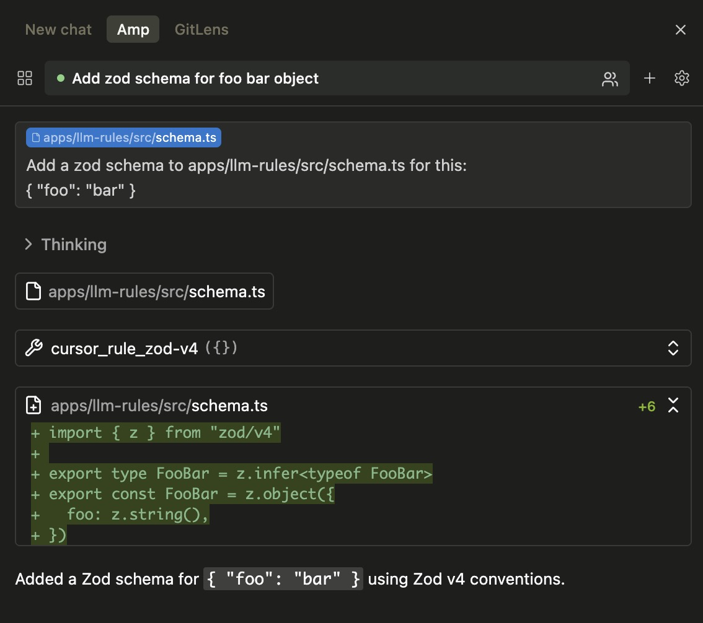

# llm-rules

A Model Context Protocol (MCP) server that provides tools for accessing both Cursor rules (`.cursor/rules/*.mdc`) and client-hosted context files (`.context/*`) within a repository. This allows AI tools like Claude and other LLM assistants to access and use context-aware coding guidelines through the MCP protocol.

## Overview

This package creates an MCP server that dynamically discovers both Cursor rule files and client-hosted context files, exposing them as callable tools. Each file becomes a tool that can be invoked to retrieve the content, with descriptions automatically extracted from the frontmatter to help AI assistants choose relevant context.

### Why use this?

Instead of loading all context files into your AI assistant at once, this MCP server allows tools like AmpCode and Claude Code to dynamically load only the context that's relevant to your current task. This approach offers several benefits:

- **More flexible than static files** - Unlike `AGENT.md` or `CLAUDE.md` which are always loaded, Cursor rules include descriptions that tell the LLM exactly when to use them
- **Reduced context size** - Only relevant rules are loaded, leaving more space for your actual code and conversation
- **Better performance** - Smaller context means faster responses and lower token usage
- **Smarter rule selection** - Tool descriptions include file patterns (`globs`) and always-apply status, helping AI assistants choose the right rules automatically
- **Scalability** - Add as many rules as needed without bloating the initial context
- **Real-time updates** - Changes to rule files are immediately available without restarting your AI assistant

## Demo



_Example showing AmpCode automatically using the `cursor_rule_zod-v4` tool when working with Zod, ensuring proper v4 imports are used._

## Usage

Start the MCP server:

```bash
# Using npx
npx llm-rules@latest --dir /path/to/your/repository

# Using bunx
bunx llm-rules@latest --dir /path/to/your/repository

# Or from the current working directory (--dir is optional)
npx llm-rules@latest
```

The `--dir` flag is optional and defaults to the current working directory.

**Note:** When using the AmpCode extension for VSCode/Cursor/Windsurf, the `--dir` flag is not needed as the extension automatically sets the working directory to your project root.

**The server will:**

- Scan the specified directory (or current directory) for:
  - `.cursor/rules/*.mdc` files (Cursor rules)
  - `.context/*.md`, `.context/*.mdc`, `.context/*.txt` files (client-hosted context)
- Create MCP tools for each file:
  - `cursor_rule_<filename>` for Cursor rules
  - `context_<filename>` for client-hosted context files
- Extract descriptions and metadata from frontmatter to help LLMs understand when to use each tool
- Include file patterns (`appliesTo`/`globs`), trigger types, and source information in tool descriptions
- Support client-hosted context configuration via `.context/context-config.json`
- Serve the content through the MCP protocol on stdio

### MCP Configuration

To use with MCP clients, add to your `mcp.json` or similar configuration:

```json
{
  "mcpServers": {
    "llm-rules": {
      "command": "npx",
      "args": ["llm-rules@latest", "--dir", "/path/to/your/repository"]
    }
  }
}
```

**AmpCode Extension Users:** If you're using the AmpCode extension, you can omit `--dir`:


For Claude Desktop, add to `claude_desktop_config.json`:

```json
{
  "mcpServers": {
    "llm-rules": {
      "command": "npx",
      "args": ["llm-rules@latest", "--dir", "/path/to/your/repository"]
    }
  }
}
```

### Example Cursor Rule

Here's an example Cursor rule file (`.cursor/rules/zod-v4.mdc`):

```markdown
---
description: Zod v4 Coding Guidelines. ALWAYS read this when using Zod
globs:
alwaysApply: false
---

# Zod v4 Coding Guidelines

## Important: Always Use Zod v4

When working with Zod, **ALWAYS** use Zod v4 by importing from `'zod/v4'`. Never use the default `'zod'` import, which is Zod v3.
```

This creates a tool named `cursor_rule_zod-v4` with the description "Read Cursor rule: Zod v4 Coding Guidelines. ALWAYS read this when using Zod". The LLM can see from the description that this rule should be loaded when working with Zod.

See [the complete example](./src/test/fixtures/valid/.cursor/rules/zod-v4.mdc) for the full rule content.

### Example Client-Hosted Context

The server also supports the [Client-hosted Context specification](./docs/specs/local-context-support.md). Here's an example context file (`.context/typescript-conventions.md`):

```markdown
---
description: 'TypeScript coding conventions and best practices'
appliesTo: ['**/*.ts', '**/*.tsx']
trigger: pattern
---

# TypeScript Conventions

- Use strict type checking
- Prefer interfaces over types for object shapes
- Use descriptive variable names
- Always use async/await over Promises
```

This creates a tool named `context_typescript-conventions` with the description "Read context: TypeScript coding conventions and best practices (applies to **/\*.ts,**/\*.tsx, trigger: pattern, source: static)". The LLM can see this should be loaded when working with TypeScript files.

**Context Configuration**

You can customize context loading with `.context/context-config.json`:

```json
{
  "clientContext": {
    "includeFiles": ["*"],
    "excludeFiles": ["context-config.json", "**/*.private.md"],
    "ignoreGlobalContext": false,
    "ignoreAncestorContext": false
  }
}
```

**Supported Context File Formats:**

- **Markdown files** (`.md`, `.mdc`) - Support frontmatter with properties like `description`, `appliesTo`, `trigger`
- **Text files** (`.txt`) - Plain text without frontmatter
- **Trigger types**: `always` (always loaded), `pattern` (loaded for matching files), `agent` (available for AI to choose), `manual` (explicit reference only)

### Tool Parameters

Each generated tool takes no parameters and returns the content without frontmatter. Tool descriptions automatically include metadata from frontmatter to help LLMs choose relevant context without reading content first:

- **Cursor rules**: Include `globs` patterns and `always-apply` status
- **Client-hosted context**: Include `appliesTo` patterns, `trigger` type, and `source` information

## Limitations

- **Single-level directory scanning** - Only checks for files at the directory specified by `--dir`:
  - `.cursor/rules/` for Cursor rules
  - `.context/` for client-hosted context
  - Does not recursively search subdirectories
- **File changes require restart** - Changes to files require restarting the MCP server to be detected
- **Basic client-hosted context support** - Currently supports static directory context only (no dynamic subdirectory context yet)

## Roadmap

Future enhancements planned:

- **Auto-reload after file changes** - Automatically detect and reload files when they change, eliminating the need to restart the server
- **Dynamic project directory tool** - Add an MCP tool to set the project directory dynamically, removing the need for the `--dir` flag
- **Nested directory support** - Load context files from subdirectories and expose them contextually based on the current working location
- **Full client-hosted context spec** - Complete implementation including dynamic subdirectory context, global context, and configuration merging
- **Pattern-based filtering** - Apply `includeFiles`/`excludeFiles` glob patterns from context configuration

## Contributing

See [CONTRIBUTING.md](CONTRIBUTING.md) for development setup and guidelines.
