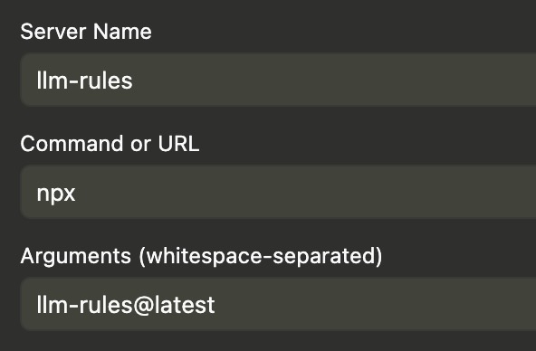

# llm-rules

A Model Context Protocol (MCP) server that provides tools for accessing Cursor rules found in `.cursor/rules/*.mdc` files within a repository. This allows AI tools like Claude and other LLM assistants to access and use Cursor rules through the MCP protocol.

## Overview

This package creates an MCP server that dynamically discovers Cursor rule files and exposes them as callable tools. Each rule file becomes a tool that can be invoked to retrieve the rule content, with descriptions automatically extracted from the frontmatter.

## Usage

Start the MCP server:

```bash
# Using npx
npx llm-rules@latest --dir /path/to/your/repository

# Using bunx
bunx llm-rules@latest --dir /path/to/your/repository

# Or from the current working directory (--dir is optional)
npx llm-rules@latest
```

The `--dir` flag is optional and defaults to the current working directory. **Note:** When using the AmpCode extension for VSCode, Cursor, or Windsurf, the `--dir` flag is not needed as the extension automatically sets the working directory to your project root.

The server will:

- Scan the specified directory (or current directory) for `.cursor/rules/*.mdc` files
- Create MCP tools named `cursor_rule_<filename>` for each rule
- Extract descriptions and metadata from frontmatter to help LLMs understand when to use each tool
- Include file patterns (`globs`) and always-apply status in tool descriptions for better context
- Serve the rules through the MCP protocol on stdio

### MCP Configuration

To use with MCP clients, add to your `mcp.json` or similar configuration:

```json
{
	"mcpServers": {
		"llm-rules": {
			"command": "npx",
			"args": ["llm-rules@latest", "--dir", "/path/to/your/repository"]
		}
	}
}
```

**AmpCode Extension Users:** If you're using the AmpCode extension, you can omit `--dir`:



For Claude Desktop, add to `claude_desktop_config.json`:

```json
{
	"mcpServers": {
		"llm-rules": {
			"command": "npx",
			"args": ["llm-rules@latest", "--dir", "/path/to/your/repository"]
		}
	}
}
```

### Tool Parameters

Each generated tool takes no parameters and returns the rule content without frontmatter. Tool descriptions automatically include metadata from frontmatter (file patterns, always-apply status) to help LLMs choose relevant rules without reading their content first.

## Features

- Dynamic rule discovery from `.cursor/rules/` directories
- MCP protocol compliance for integration with AI tools
- Automatic tool generation with descriptive names
- Frontmatter parsing for rule metadata
- Smart tool descriptions that include file patterns and always-apply status
- Token-efficient design - LLMs can see rule applicability without reading content
- Comprehensive error handling and YAML sanitization

## Contributing

See [CONTRIBUTING.md](CONTRIBUTING.md) for development setup and guidelines.

```

```
